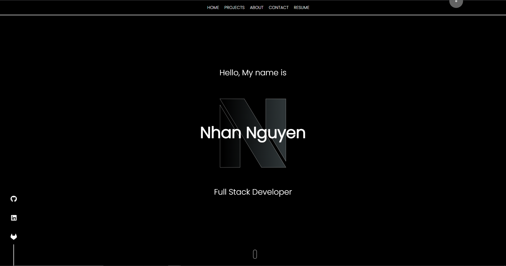

 # 18_React_NN
React: Personal Portfolio

## Introduction
Mobile responsive personal portfolio. This portfolio include modern features such as: 
* Landing page with engineered stroke-dash animation
* A sticky side footer for socials 
* Animation on-hover navigation bar with link to Resume
* Preloader animation using gsap library
* Animated SVG scroll down button
* Cursor animation
* AOS on-scroll animation for smooth scrolling
* Framer-motion to render component animations
* Email JS to validate and send email from contact form
* Google Map API to show current location
* Spinning Skill Cube made with pure css



## User Story

```
AS AN employer looking for candidates with experience building single-page applications
I WANT to view a potential employee's deployed React portfolio of work samples
SO THAT I can assess whether they're a good candidate for an open position
```

## Acceptance Criteria

```
GIVEN a single-page application portfolio for a web developer
WHEN I load the portfolio
THEN I am presented with a page containing a header, a section for content, and a footer
WHEN I view the header
THEN I am presented with the developer's name and navigation with titles corresponding to different sections of the portfolio
WHEN I view the navigation titles
THEN I am presented with the titles About Me, Portfolio, Contact, and Resume, and the title corresponding to the current section is highlighted
WHEN I click on a navigation title
THEN I am presented with the corresponding section below the navigation without the page reloading and that title is highlighted
WHEN I load the portfolio the first time
THEN the About Me title and section are selected by default
WHEN I am presented with the About Me section
THEN I see a recent photo or avatar of the developer and a short bio about them
WHEN I am presented with the Portfolio section
THEN I see titled images of six of the developer’s applications with links to both the deployed applications and the corresponding GitHub repositories
WHEN I am presented with the Contact section
THEN I see a contact form with fields for a name, an email address, and a message
WHEN I move my cursor out of one of the form fields without entering text
THEN I receive a notification that this field is required
WHEN I enter text into the email address field
THEN I receive a notification if I have entered an invalid email address
WHEN I am presented with the Resume section
THEN I see a link to a downloadable resume and a list of the developer’s proficiencies
WHEN I view the footer
THEN I am presented with text or icon links to the developer’s GitHub and LinkedIn profiles, and their profile on a third platform (Stack Overflow, Twitter)

``` 

## Submission
This portfolio was uploaded to GitHub at the following repository link:
[https://github.com/nhanng19/portfolio_react](https://github.com/nhanng19/portfolio_react)

Deployed Link:
[https://www.nhanngyn.tech/](https://www.nhanngyn.tech/)
